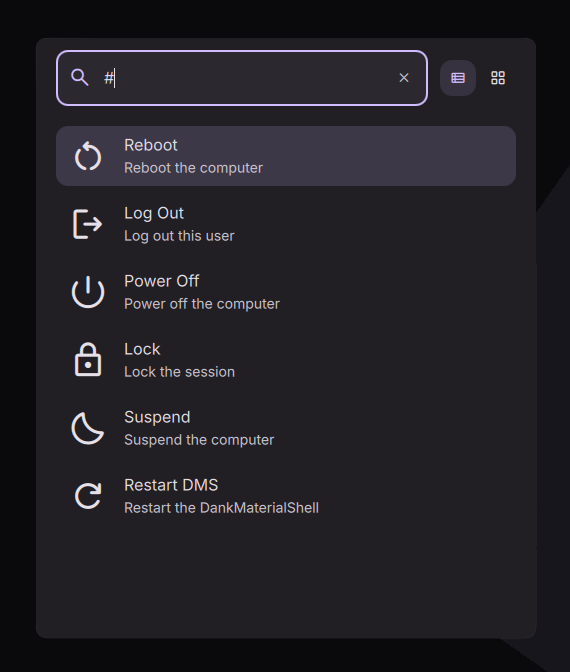

# PowerOptions
Plugin for DMS / DankMaterialShell Launcher; Access power options like shutdown and reboot from the launcher

## Features
- Exposes only the enabled power options from DMS settings
- Supports configuration of trigger in plugin settings to a specific trigger (default: "#") or no trigger (will always match)
- Matches on related keywords (Reboot will also appear when typing "restart" or "reset", etc)
- Translation / I18n support

## Remarks
- No confirmation is needed; the chosen action is performed immediately

## Screenshot

